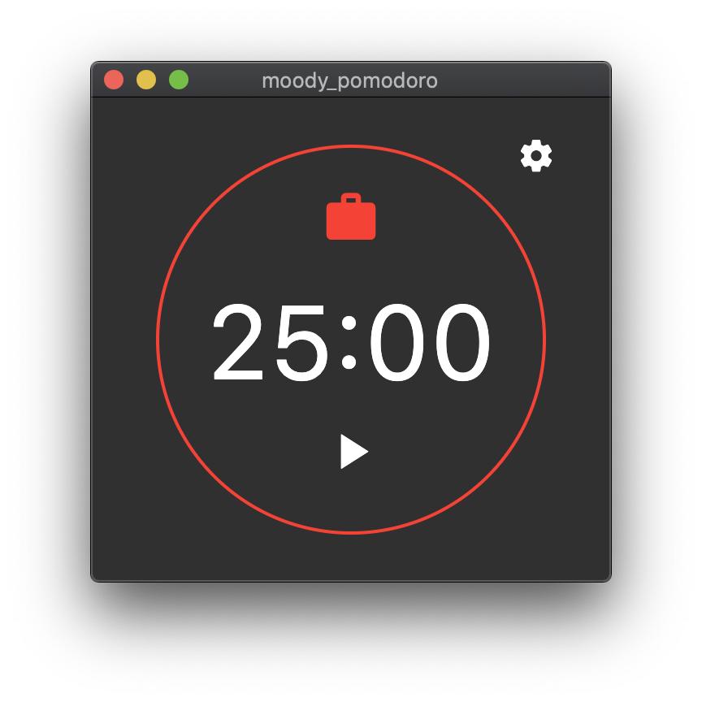
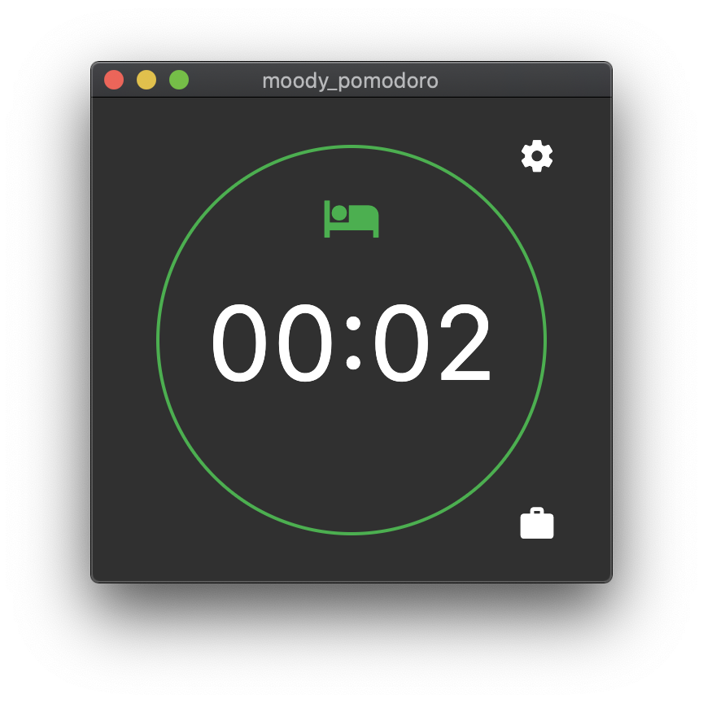

# moody_pomodoro

The pomodoro timer for the moody.

- [x] Start a pomodoro.
- [x] Take a short breaking.
- [ ] Take a long breaking.
- [x] Always take a short breaking.
- [x] Always start a pomodoro.
- [ ] Signal the end of pomodoro or breaking with full screen.
  - [x] Ubuntu
  - [x] macOS
  - [ ] Windows

